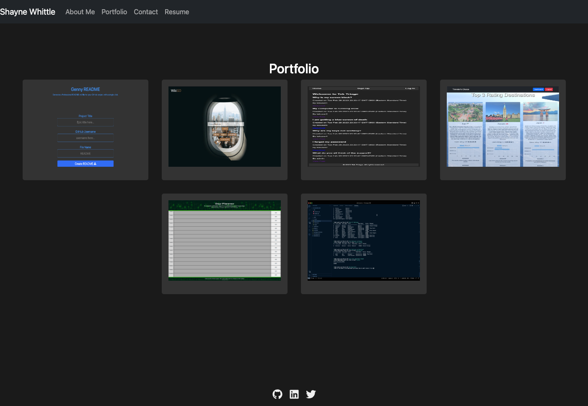

# reactfolio

## Description

Reactfolio is Shayne Whittle's developer portfolio website built using React. The website showcases the developer's projects and provides an easy way for visitors to get in touch through a contact form. It includes responsive design for an optimized user experience on both desktop and mobile devices.

## Table of Contents

- [Installation](#installation)
- [Usage](#usage)
- [Credits](#credits)
- [License](#license)
- [Features](#features)
- [How to Contribute](#how-to-contribute)
- [Tests](#tests)
- [Questions](#questions)

## Installation

To run the project locally, follow these steps:

1. Clone the project [Project repo](https://github.com/shaynefw/reactfolio).

2. Navigate to the project folder and `run npm install` to install the required dependencies.

3. Run `npm start` to start the development server.

4. Open your browser and go to `http://localhost:3000` or designated 300x port to view the website.

Here is the [deployed project link](https://shaynefw.github.io/reactfolio/)

## Usage

## Credits

Credits to my professor, instructors, classmates, and tutors for their invaluable support and guidance throughout my learning journey. Also to the developers of the various technologies used, including Google, documentation resources, and AI technologies that have provided valuable assistance and inspiration.

## License

MIT License

Copyright (c) 2023 Shayne Whayne

Permission is hereby granted, free of charge, to any person obtaining a copy
of this software and associated documentation files (the "Software"), to deal
in the Software without restriction, including without limitation the rights
to use, copy, modify, merge, publish, distribute, sublicense, and/or sell
copies of the Software, and to permit persons to whom the Software is
furnished to do so, subject to the following conditions:

The above copyright notice and this permission notice shall be included in all
copies or substantial portions of the Software.

THE SOFTWARE IS PROVIDED "AS IS", WITHOUT WARRANTY OF ANY KIND, EXPRESS OR
IMPLIED, INCLUDING BUT NOT LIMITED TO THE WARRANTIES OF MERCHANTABILITY,
FITNESS FOR A PARTICULAR PURPOSE AND NONINFRINGEMENT. IN NO EVENT SHALL THE
AUTHORS OR COPYRIGHT HOLDERS BE LIABLE FOR ANY CLAIM, DAMAGES OR OTHER
LIABILITY, WHETHER IN AN ACTION OF CONTRACT, TORT OR OTHERWISE, ARISING FROM,
OUT OF OR IN CONNECTION WITH THE SOFTWARE OR THE USE OR OTHER DEALINGS IN THE
SOFTWARE.

## Badges

## Features

- Responsive design optimized for desktop and mobile devices
- Dark theme
- Project showcase with hover effect and buttons for App and Repo links
- Contact form with validation.

## How to Contribute

If you would like to contribute to this project, please follow these steps:

1. Fork the repository on GitHub.
2. Clone your forked repository and create a new branch for your feature or bugfix.
3. Commit your changes to your branch.
4. Push your changes to your forked repository.
5. Create a pull request to the main repository, describing your changes and referencing any related issues.

## Tests

Currently, there are no tests implemented for this project. If you would like to contribute by adding tests, please follow the [How to Contribute](#how-to-contribute) section.

## Questions

If you have any questions or need assistance, you can reach me by...

- Creating a new issue in the [project repo](https://github.com/shaynefw/reactfolio).
- Sending me a message to my [LinkedIn](https://www.linkedin.com/in/shayne-whittle/).

Before submitting a question, please check the existing issues and pull requests to see if your question has already been addressed. If you're not sure about something, don't hesitate to ask.
